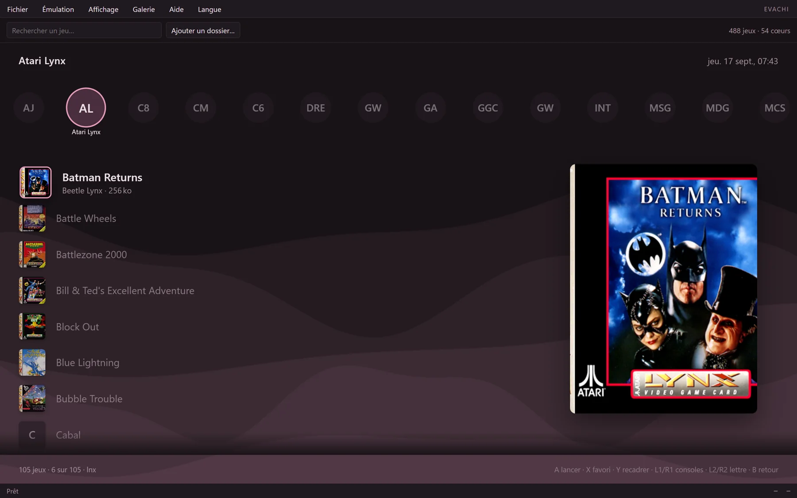
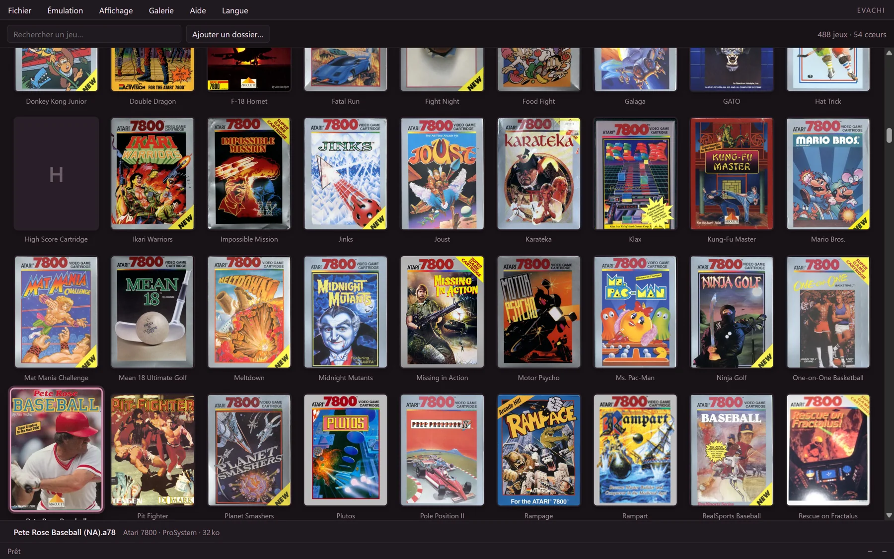
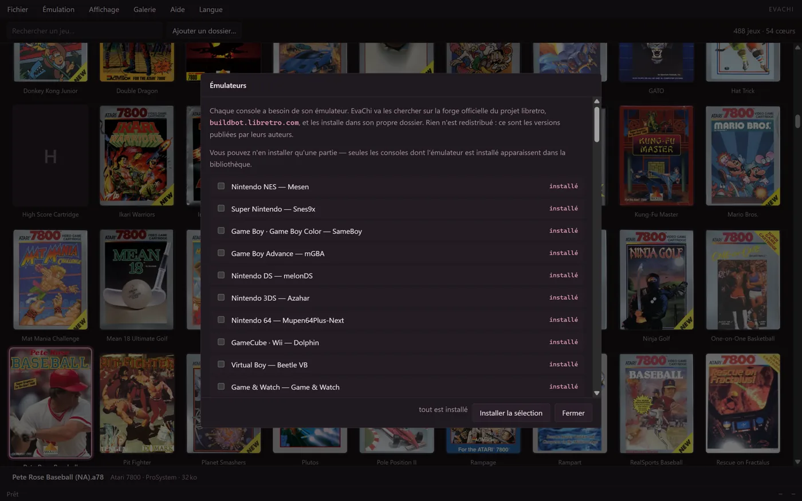

# EvaChi

**Toute une collection de jeux dans une seule fenêtre.** Quarante-huit consoles,
les émulateurs installés tout seuls, les jaquettes trouvées toutes seules, et
tout se pilote à la manette.

[**→ Télécharger la dernière version**](../../releases/latest) · Windows 10 ou 11,
64 bits · logiciel libre, GPL-3.0-or-later



## Ce que c'est

Émuler quinze consoles demande d'habitude quinze programmes, quinze dossiers,
quinze façons de régler une manette. EvaChi fait l'inverse : **une interface,
une bibliothèque, et les émulateurs qu'elle va chercher elle-même** quand on lui
dit quelles consoles on veut.

Ce n'est pas un lanceur qui ouvre d'autres fenêtres. Les émulateurs tournent
sous son interface, dans son habillage, avec ses raccourcis — et depuis la
0.4.0, **chacun dans son propre processus**, pour que celui qui plante ne fasse
plus disparaître l'application.

## Commencer

1. **Lancer `evachi.exe`.** Rien à installer.
2. **Émulation → Émulateurs…** : cocher les consoles voulues, *Installer la
   sélection*. EvaChi va les chercher chez leurs auteurs.
3. **Déposer ses jeux** dans `roms/`, dans le sous-dossier de la console. Le nom
   du dossier suffit : EvaChi en déduit quoi employer.

Les quarante-huit dossiers sont déjà là, vides.

## Ce qu'elle sait faire

|   |   |
|---|---|
| **Six présentations** | un menu animé, un carrousel de jaquettes, un paquet de cartes que l'on tient en éventail, une séance de projection, une grille, une liste dense |
| **Les jaquettes toutes seules** | trouvées sur le serveur du projet libretro, recadrables à la main si elles tombent mal |
| **Cinquante langues** | chacune dans son alphabet, avec ses pluriels, ses dates et ses unités |
| **Trente-six palettes** | aucune choisie à l'œil : chacune est vérifiée au rapport de contraste du W3C |
| **La langue des jeux** | réglée à part de celle de l'interface : une cartouche européenne démarre enfin dans la sienne |
| **Un panneau de triches** | les fiches publiées par libretro, et un chercheur de valeurs en mémoire pour les jeux qui n'en ont pas |
| **Un dossier où jeter ses jeux** | `drop u'r rom` : on y dépose en vrac, EvaChi range au lancement suivant et demande ce qu'elle ne peut pas deviner |
| **Les touches portées** | réassigner un bouton ici l'écrit aussi chez PCSX2, PPSSPP et Dolphin, chacun dans son dialecte |
| **Pencher et secouer** | les jeux qui lisent un accéléromètre reçoivent le manche droit, et une secousse à la demande |
| **Trois filtres d'image** | balayage, quadrillage et tube cathodique, calculés par la carte graphique à la taille affichée |
| **Tout à la manette** | y compris le plein écran, les captures, les sauvegardes d'état et l'avance rapide |
| **Des thèmes** | et un plein écran « console de salon » qui retire jusqu'aux barres |
| **Un cœur écrit ici** | CHIP-8, complet, avec ses six écarts de comportement — le reste vient de libretro |



## Ce qu'elle ne contient pas, et ne contiendra jamais

**Aucune ROM. Aucun BIOS. Aucune clé. Aucun micrologiciel. Aucun émulateur.**

Écrire un émulateur est légal — c'est de la rétro-ingénierie de comportement,
pas de la copie de code, et la jurisprudence est établie. Distribuer les jeux et
les micrologiciels d'origine ne l'est pas, et EvaChi ne le fait pas.

Les émulateurs ne sont pas redistribués non plus : elle va les chercher, à la
demande, là où leurs auteurs les publient.



## À qui l'on doit les émulateurs

**EvaChi n'en écrit aucun. Elle en héberge.** Chacun est un projet libre à part
entière, mené par d'autres, et sans eux cette application n'afficherait rien.

Les noms, les auteurs et les licences ci-dessous sont **ceux que chaque projet
déclare lui-même** — relevés dans les fiches que publie le projet libretro et
dans les dépôts des émulateurs autonomes, jamais écrits de mémoire. Une erreur
ici serait la nôtre : écrivez-nous plutôt que de supposer.

Six cœurs portent une **licence non commerciale**, signalée dans la liste. Sans
conséquence ici — EvaChi ne les redistribue pas et ne se vend pas — mais qui
reprendrait ce travail doit le savoir avant, pas après.

<!-- credits:debut -->

<details><summary><b>Les 44 cœurs libretro</b> — nom, console, licence, auteurs</summary>

| Cœur | Console | Licence | Auteurs |
|---|---|---|---|
| Atari800 | Atari 800 · 5200 | GPLv2 | Petr Stehlik |
| Azahar | Nintendo 3DS | GPLv2+ | Azahar Emulator |
| Beetle Lynx | Atari Lynx | Zlib\|GPLv2 | K. Wilkins, Mednafen Team |
| Beetle NeoPop | Neo Geo Pocket | GPLv2 | neopop_uk, Mednafen Team |
| Beetle PCE Fast | PC Engine · TurboGrafx | GPLv2 | Mednafen Team |
| Beetle Saturn | Saturn | GPLv2 | Mednafen Team |
| Beetle VB | Virtual Boy | GPLv2 | Mednafen Team |
| Beetle WonderSwan | WonderSwan | GPLv2 | Dox, Mednafen Team |
| blueMSX | MSX · ColecoVision | GPLv2 | Daniel Vik |
| Caprice32 | Amstrad CPC | GPLv2 | Ulrich Doewich, dantoine |
| Citra | 3DS | GPLv2+ | Citra Emulation Project |
| Citra 2018 | 3DS | GPLv2+ | Citra Emulation Project |
| Dolphin | GameCube · Wii | GPLv2+ | Team Dolphin |
| DOSBox-pure | MS-DOS | GPLv2 | DOSBox Team, Psyraven |
| FinalBurn Neo | Arcade | **Non-commercial** | Team FBNeo |
| Flycast | Dreamcast | GPLv2 | flyinghead |
| FreeIntv | Intellivision | GPLv2+ | David Richardson |
| Fuse | ZX Spectrum | GPLv3 | Team Fuse |
| Gambatte | Game Boy/Game Boy Color | GPLv2 | Sinamas |
| Genesis Plus GX | Mega Drive · Master System · Game Gear · Mega-CD | **Non-commercial** | Charles McDonald, Eke-Eke |
| GW | Game & Watch | zlib | Andre Leiradella |
| LRPS2 | Sony PlayStation 2 | GPL | PCSX2 Team |
| melonDS | Nintendo DS | GPLv3 | Arisotura |
| Mesen | Nintendo NES | GPLv3 | M. Bibaud (aka Sour) |
| mGBA | Game Boy Advance | MPLv2.0 | endrift |
| Mupen64Plus-Next | Nintendo 64 | GPLv2 | m4xw, Hacktarux, gonetz, GLideN64 Contributors, Mupen64Plus Team |
| Neko Project II Kai | PC-98 | MIT | Neko Project II Team, Tomohiro Yoshidomi |
| Opera | 3DO | **LGPL/Non-commercial** | trapexit, JohnnyDude, FreeDO team |
| PicoDrive | Sega 32X | **MAME** | notaz, fdave, irixxxx |
| PPSSPP | PSP | GPLv2 | Henrik Hrydgard |
| ProSystem | Atari 7800 | GPLv2 | Greg Stanton, Brian Berlin, Leonis, Greg DeMent |
| PUAE | Amiga | GPLv2 | UAE Team |
| PX68k | Sharp X68000 | **Custom Non-Commercial** | hissorii |
| SAME CDi (Git) | CD-i | GPLv2+ | MAMEdev |
| SameBoy | Game Boy · Game Boy Color | MIT | LIJI32 |
| ScummVM | Point & click | GPLv3 | SCUMMVMdev |
| Snes9x | Super Nintendo | **Non-commercial** | Snes9x Team |
| Stella | Atari 2600 | GPLv2 | Stephen Anthony, Bradford Mott, Eckhard Stolberg, Brian Watson |
| Stella 2014 | Atari 2600 | GPLv2 | Stephen Anthony, Bradford Mott, Eckhard Stolberg, Brian Watson |
| SwanStation | PlayStation | GPLv3 | stenzek |
| theodore | Thomson MO5 · TO7 | GPLv3 | T. Lorblanches |
| vecx | Vectrex | GPLv3 | Valavan Manohararajah, John Hawthorn, Nikita Zimin, Demeth |
| VICE x64 | Commodore 64 | GPLv2 | VICE Team |
| Virtual Jaguar | Atari Jaguar | GPLv3 | Joseph Mattiello, David Raingeard, Shamus |

</details>

<details><summary><b>Les 9 émulateurs autonomes</b> — ceux qui gardent leur propre fenêtre</summary>

| Émulateur | Console | Licence | Projet |
|---|---|---|---|
| Cemu | Wii U | MPL-2.0 | https://cemu.info |
| PCSX2 | PlayStation 2 | GPL-3.0 | https://pcsx2.net |
| PPSSPP | PSP | GPL-2.0-or-later | https://www.ppsspp.org |
| Dolphin | GameCube · Wii | GPL-2.0-or-later | https://dolphin-emu.org |
| Xenia Canary | Xbox 360 | BSD-3-Clause | https://xenia.jp |
| xemu | Xbox | GPL-2.0 | https://xemu.app |
| Azahar | Nintendo 3DS | GPL-3.0 | https://azahar-emu.org |
| Vita3K | PS Vita | GPL-2.0 | https://vita3k.org |
| Ryubing | Nintendo Switch | MIT | https://ryujinx.app |

</details>

<!-- credits:fin -->

## Sous le capot

Rust et TypeScript, dans une coque [Tauri](https://tauri.app). Le cœur CHIP-8 et
toute l'interface sont écrits pour ce projet ; les autres consoles passent par
l'ABI [libretro](https://www.libretro.com).

- [`docs/isolement.md`](docs/isolement.md) — pourquoi et comment chaque
  émulateur tourne dans son propre processus, et ce que ça ne répare pas
- [`docs/coeurs.md`](docs/coeurs.md) — le choix des cœurs, leurs licences, et ce
  que chacune impose au reste

```bash
npm install
npm run test:all          # 722 épreuves côté fenêtre, 286 côté Rust
npm run app:build         # l'exécutable, dans src-tauri/target/release/
node outils/livraison.mjs <dossier>   # monte une livraison complète
```

Le code et les commentaires sont en français. C'est délibéré : un commentaire
dit *pourquoi*, et on écrit mieux le pourquoi dans sa propre langue.

## Licence

**GNU GPL version 3 ou ultérieure** — voir [LICENSE](LICENSE).

Libre d'utiliser, d'étudier, de modifier et de redistribuer, à la condition d'en
transmettre le code source. Les émulateurs qu'EvaChi télécharge ne sont pas
couverts par cette licence : chacun garde la sienne.
